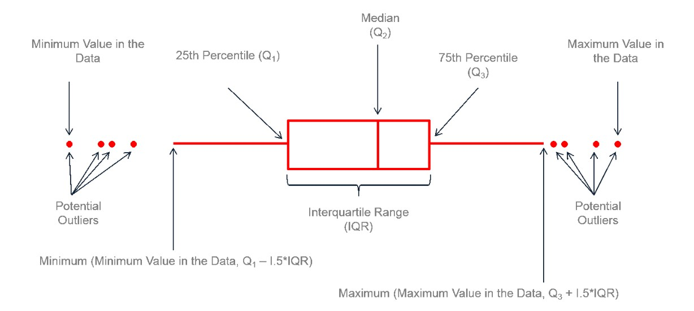

# The basic

## R Markdown
[R Markdown Cheat Sheet](https://www.rstudio.com/wp-content/uploads/2015/02/rmarkdown-cheatsheet.pdf)

[R Markdown Tutorial](https://rmarkdown.rstudio.com/)


```{r}
# ```{r echo=FALSE} hide code
# ```{r eval=FALSE} hide output


```

### Interactive docs

Choose a time series
```{r echo = FALSE}
library(shiny)
data("Orange")
#head(Orange, 8)
#names(Orange)
attach(Orange)
detach(Orange)
#summary(Orange)
selectInput("Orange","",c("Tree", "age","circumference"))
```

See a plot
```{r echo=FALSE}
renderPlot({
  d <- get(input$Orange)
  plot(d)
})
```

### Tabbed sections

#### Qurterly Results {.tabset .tabset-fade .tabset-pills}

##### Tab A

( add tab content A)

##### Tab B

(add tab content B)


## R import
```{r}
getwd()
# set work directory
# setwd()
# import dataset
# my_data<-read.table(file.choose(),header = T, sep = "\t")
# attach(my_data)
# names(my_data)

```

## Samplying and samplying distribution

### Common distributions for discrete random variables

* Binomial distribution 

* Poisson distribution 

* Hypergeometric distribution 


### Common continuous probability distributions

* Continuous uniform distribution 

* 


### Generate pseudorandom numbers

```{r}
# make reproducible output
set.seed(12345)
rpois(5,3) # poisson distribution
rnorm(5) # normal distribution 


```


### Stratified sampling
[What's it about?](https://www.wallstreetmojo.com/stratified-sampling/#how-stratified-sampling-method-works)

# Data manipulation

[Data manipulation in R](https://www.youtube.com/watch?v=nRtp7wSEtJA)

```{r}
# Create systematic data tables
# expand.grid(SITE=c("A","B"),TREAT=c("low","med","high"), REP=c(1:5))

```

## Dplyr

[Dplyr Essentials](https://www.youtube.com/watch?v=Gvhkp-Yw65U)

[Dplyr Advanced Guide](https://www.youtube.com/watch?v=DiY8EqZDwoI)


# Analysis

## Data types

[Types of data in statistics](https://www.mymarketresearchmethods.com/data-types-in-statistics/)


## Statistical Analysis 

What statistical methods to use for data analysis depends on the data types. [Link](https://learncuriously.wordpress.com/2022/06/05/crash-course-on-statistical-analysis/)


## Statistical tests


## histogram
```{r}
v<-c(9,13,21,8,36,22,12,41,31,33,19)
#png(file = "histogram.png")#name chart
hist(v, xlab = "weight", col = "yellow", border = "blue", 
     xlim = c(0,40), ylim = c(0,5),breaks = 5)
#dev.off()# save the file

```

## boxplot

### Anatomy of a boxplot

[How to read boxplot?](https://r-graph-gallery.com/boxplot.html)


### Skewness in boxplot

left-skewed = negatively skewed; right-skewed = positively skewed

**`boxplot()` can summarize the distribution of numeric variables but can also loose information on underlying distribution of dots of each group.**

### Draw boxplot

#### Simple boxplot

[Tutorial-boxplot in r](https://www.youtube.com/watch?v=U64yNvlhv9I)

```{r}
data("chickwts")
#attach(chickwts)
#head(chickwts,6)
names(chickwts)
# install.packages("dplyr") # for select() function
library(dplyr)
summary(select(chickwts,weight, feed))
# alternatively, use pipe operator %>% such as below:
chickwts %>% 
  select(weight, feed) %>%
  summary()


class(chickwts$weight)
class(chickwts$feed)

# To get each critical values
quantile(chickwts$weight, probs = c(0, 0.25, 0.5, 0.75, 1))

boxplot(chickwts$weight ~ chickwts$feed, 
        main = "Weight by feed", xlab = "Types of feed", ylab = "Chick weight", 
        ylim = c(0,450), las = 1) # las = 1 rotate y axis number.

```

#### Adding `jitter`

```{r warning=FALSE}
data("chickwts")
attach(chickwts)
names(chickwts)

library(ggplot2)
library(viridis)
library(hrbrthemes)

myplot1<-ggplot(chickwts, aes(x = feed, y = weight, fill = feed)) +
  geom_boxplot() +
  scale_fill_viridis(discrete = TRUE) +
  geom_jitter(color = "grey", size = 0.7, alpha = 0.5) +
  theme_ipsum() +
  theme(
    legend.position = "none",
    plot.title = element_text(size = 11)
  ) +
  ggtitle("A boxplot with jitter") +
  xlab("")

myplot1

```

#### Violin plot

For large sample size, adding jitter can make the firgure 'messy', can use violin plot instead.

```{r warning=FALSE}
# sample size
sample_size = chickwts %>% group_by(feed) %>% summarize(num = n())

# plot
chickwts %>%
  left_join(sample_size) %>%
  mutate(myaxis = paste0(feed, "\n", "n=", num)) %>%
  ggplot(aes(x = myaxis, y = weight, fill = feed)) +
  geom_violin(width = 1.4) +
  geom_boxplot(width = 0.1, color = "grey", alpha = 0.2) +
  #coord_flip() +
  scale_fill_viridis(discrete = TRUE) +
  theme_ipsum() +
  theme(
    legend.position = "none",
    plot.title = element_text(size = 11)
  ) +
  ggtitle("A violin plot without jitter") +
  xlab("")


```

## Scatterplots


```{r}
data("iris")
head(iris, 6)
str(iris)
names(iris)
summary(iris)

# quick plot
library(ggplot2)
qplot(Sepal.Length, Sepal.Width, data = iris,
      col = Species,
      size = Petal.Length,
      alpha = I(0.7), # transparency level of dots
      xlab = "Sepal Length",
      ylab = "Sepal Width",
      main = "Sepal Length vs. Width")

```

# RPubs

[Example cases](https://www.rpubs.com/)

